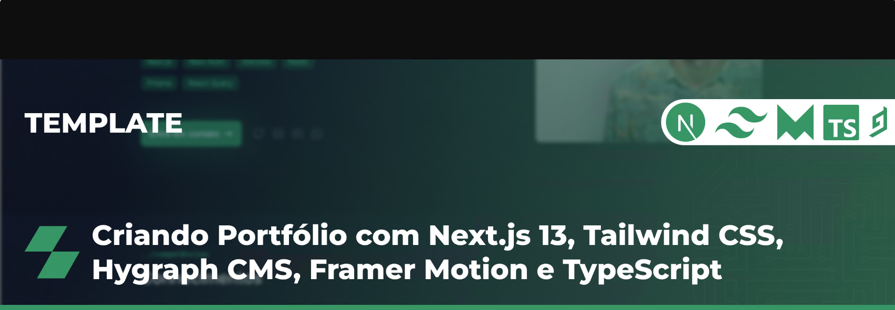

<h1 align="center">Portifólio</h1>

#### Autor

# Template Portfolio

Este é o template que utilizei para criar meu Portfolio com as ferramentas mais recentes de desenvolvimento web. O template inclui o Next.js 13, Tailwind CSS, Hygraph CMS, TypeScript e Framer Motion.

[**Referencia do Projeto**](https://github.com/GBDev13/portfolio-tutorial-2023)
